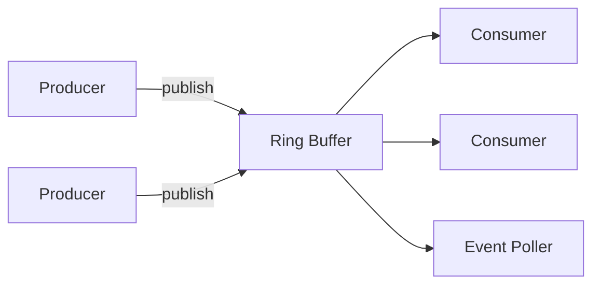

# disrupt-rs

Low latency inter-thread communication via a ring buffer, inspired by the LMAX Disruptor.

## Quickstart

Add to `Cargo.toml`:

```toml
disrupt-rs = "1.0.0"
```

### Managed threads

```rust
use disrupt_rs::{build_single_producer, BusySpin, Producer, Sequence};

struct Event {
    value: u64,
}

let factory = || Event { value: 0 };
let handler = |event: &Event, _sequence: Sequence, _end_of_batch: bool| {
    let _ = event.value;
};

let mut producer = build_single_producer(1024, factory, BusySpin)
    .handle_events_with(handler)
    .build();

for i in 0..10 {
    producer.publish(|e| e.value = i);
}
```

### Event poller

```rust
use disrupt_rs::{build_single_producer, BusySpin, Polling, Producer};

#[derive(Default)]
struct Event {
    value: u64,
}

let factory = Event::default;
let builder = build_single_producer(1024, factory, BusySpin);
let (mut poller, builder) = builder.event_poller();
let mut producer = builder.build();

producer.publish(|e| e.value = 42);
drop(producer);

loop {
    match poller.poll() {
        Ok(mut guard) => {
            for (_sequence, event) in &mut guard {
                let _ = event.value;
            }
        }
        Err(Polling::NoEvents) => continue,
        Err(Polling::Shutdown) => break,
    }
}
```

## How it fits together



## Examples

See `examples/` for runnable end-to-end examples.

## Attribution

This crate is forked from https://github.com/nicholassm/disruptor-rs.
